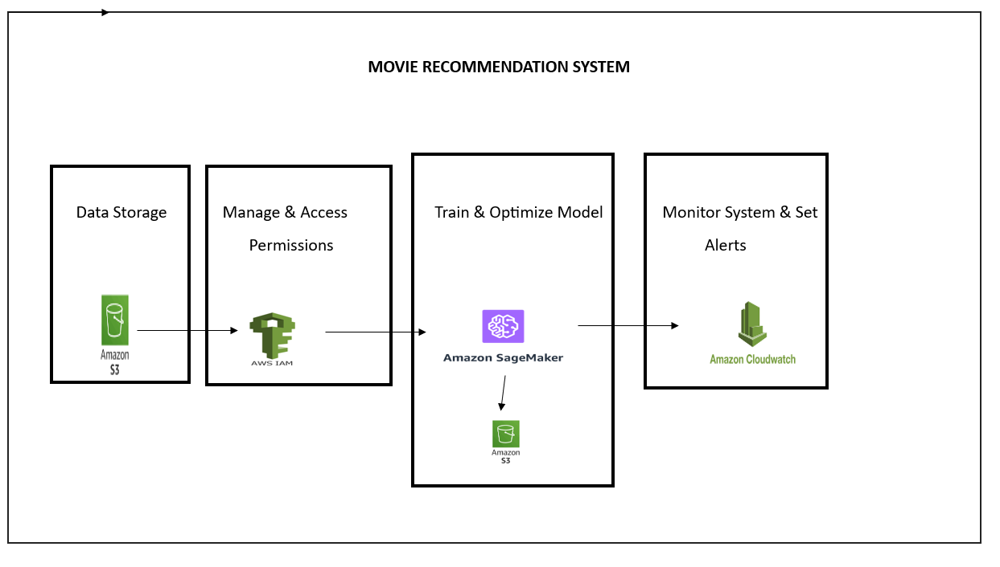

# **Movie Recommendation System Using AWS SageMaker** 🎬✨

## **Overview**
This project leverages **AWS SageMaker** to build a **personalized movie recommendation system** using **advanced Machine Learning algorithms**. The system is optimized for **scalability, accuracy, and user trust**, ensuring a seamless entertainment experience.

---

## **Project Architecture** 🏗️
The following diagram illustrates the architecture used in this project:

  

---

## **Project Outcomes *
- 📌 **Developed a recommendation model** using **Singular Value Decomposition (SVD)** with **hyperparameter tuning** for improved accuracy.
- 📌 **Trained and deployed the model on AWS SageMaker**, ensuring efficient and scalable machine learning workflows.
- 📌 **Evaluated model performance** using **Root Mean Square Error (RMSE)** and **Mean Absolute Error (MAE)** to validate recommendation accuracy.
- 📌 **Analyzed user behavior trends** with **Violin Plots, Bar Charts, and Line Graphs** for deeper insights.
- 📌 **Optimized the recommendation pipeline** to handle large-scale data efficiently.

---

## **Future Enhancements** 🚀
🔹 **Hybrid recommendation models** combining **autoencoders and collaborative filtering** for better personalization.
🔹 **Real-time recommendations** by integrating **AWS Kinesis** for dynamic updates.
🔹 **User engagement analysis** with **social media and demographic insights**.
🔹 **Cross-platform expansion** for **web, mobile, and smart TVs** to increase accessibility.

---

## **Technology Stack**
- **Machine Learning:** Singular Value Decomposition (SVD), Collaborative Filtering  
- **Cloud Services:** AWS SageMaker , AWS Cloudwatch , AWS S3
- **Programming:** Python, Pandas, Scikit-learn  
- **Visualization:** Matplotlib, Seaborn  

